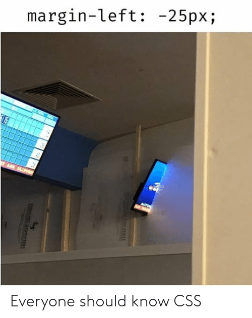
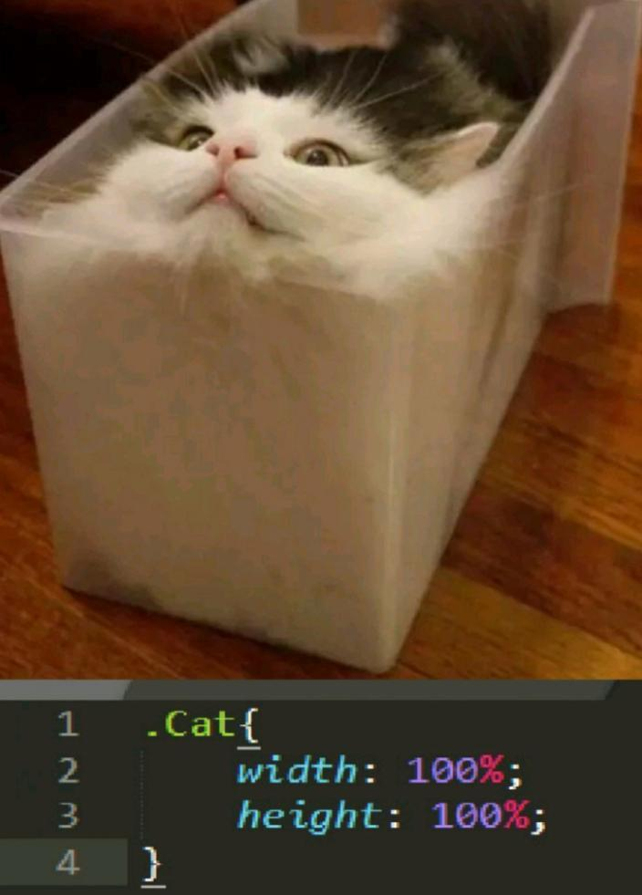
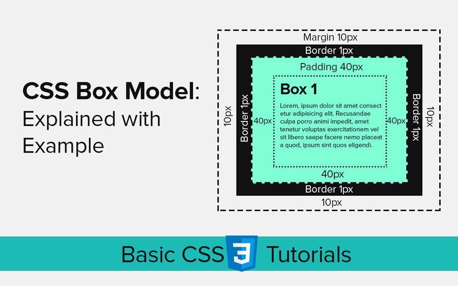
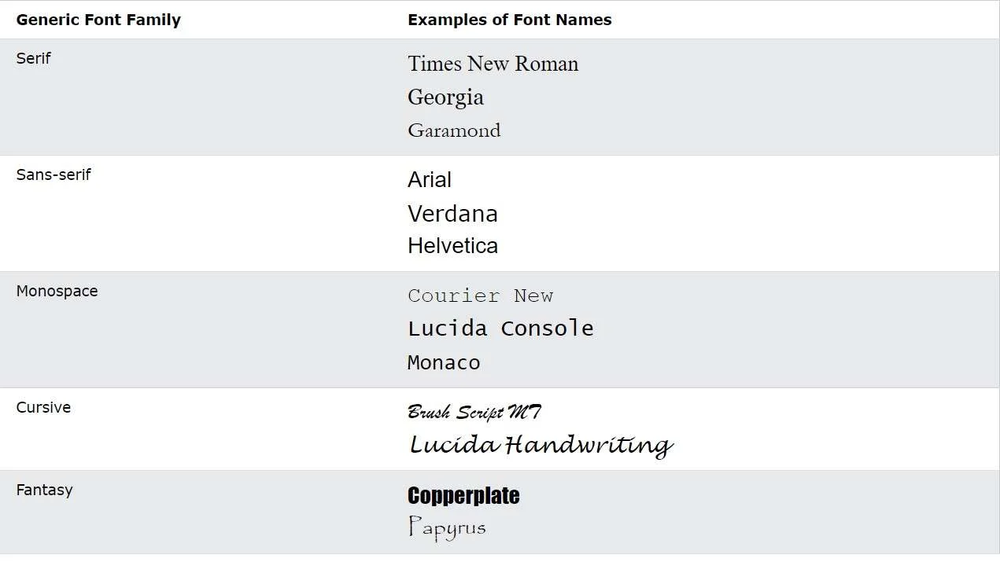

# Corso CSS3

Impariamo a usare CSS3 conoscendone le basi


<!-- _paginate: false -->
<!-- _footer: "" -->
<!-- style: "
img[alt~='center'] {
  display: block;
  margin: 0 auto;
}
" -->

---

## Scopo del corso

Queste slide nascono dalla mia curiosità verso CSS3 e dall'esperienza che ho accumulato nel corso degli anni.

La struttura base del corso ripercorre i passi seguiti da w3schools, li arricchisce con nuovi esempi ed una serie di slide in italiano.

---

## CSS

__Cascading Style Sheets__ : in italiano fogli di stile a cascata

È un linguaggio usato per definire la formattazione di documenti

Descrive lo stile degli elementi di pagina

La sua interpretazione necessita di un browser

---

## CSS – strumenti

Lo strumento che useremo durante il corso è

<https://codepen.io>

*CodePen is a social development environment. At its heart, it allows you to write code in the browser, and see the results of it as you build. A useful and liberating online code editor for developers of any skill, and particularly empowering for people learning to code. We focus primarily on front-end languages like HTML, CSS, JavaScript, and preprocessing syntaxes that turn into those things.*

Iscrivetevi e seguite il profilo creato apposta per il corso

<https://codepen.io/matteobaccan>

---

## CSS – editor

Editor

- Codepen.io
- Notepad
- Notepad++
- VisualStudio Code

Va bene qualsiasi editor, non visuale, meglio se con syntax highlighter e code completion

Le slide e i sorgenti del corso, liberamente ispirati a <https://www.w3schools.com> e costantemente aggiornati, sono disponibili a questo indirizzo

<https://github.com/matteobaccan/CorsoCSS>

---

## CSS – esempio

```css
body {
    background-color: red;
}

h1 {
    color: black;
    text-align: center;
}

p {
    font-family: courier;
    font-size: 24px;
}
```

---

## Cos'è il CSS?

CSS è acronimo di __Cascading Style Sheets__, sono fogli che vengono utilizzati per formattare le pagine web.

Con i CSS è possibile controllare il colore, il carattere, la dimensione del testo, la spaziatura tra gli elementi, il modo in cui gli elementi sono posizionati e disposti, quali immagini di sfondo o colori di sfondo devono essere utilizzati, o le diverse visualizzazioni in base alle dimensioni dello schermo.

Da notare che __cascading__ identifica il fatto che uno stile applicato a un elemento padre si applicherà anche a tutti gli elementi figli all'interno dell'elemento padre

---

## CSS inserimento in pagina

I CSS possono essere aggiunti ai documenti HTML in 3 modi:

- __Inline__ - utilizzando l'attributo style all'interno degli elementi HTML
- __Interno__ - utilizzando un elemento \<style> nella sezione \<head>
- __Esterno__ - utilizzando un elemento \<link> per collegarsi a un file CSS esterno

---

## CSS Inline

```html
<h1 style="color:blue;">Una intestazione blue</h1>

<p style="color:red;">Un paragrafo rosso</p>
```

---

## CSS Interno

```html
<head>
    <style>
        body {
            background-color: powderblue;
        }
        h1 {
            color: blue;
        }
        p {
            color: red;
        }
    </style>
</head>
```

---

## CSS Esterno

```html
<!DOCTYPE html>
<html>
    <head>
        <link rel="stylesheet" href="styles.css">
    </head>
    <body>
        <h1>Intestazione</h1>
        <p>Paragrafo</p>
    </body>
</html>
```

---

## CSS styles.css

```css
body {
    background-color: powderblue;
}

h1 {
    color: blue;
}

p {
    color: red;
}
```

---

## CSS sintassi

La sintassi di base dei CSS è data dalla dichiarazione di un __selector__, seguito da una lista di __proprietà__ e del loro relativo __valore__

```css
selector {
    proprietà: valore;
}
```

In questo caso il selettore è __body__ e la proprietà impostata è __background-color__ seguita dal suo valore __red__

```css
body {
        background-color: red;
}
```

---

## CSS selector

I __selector__ permettono di identificare in modo preciso gli elementi HTML che vogliamo personalizzare.

Esistono 5 categorie diverse di __selector__

__selector semplici :__ selezionano gli elementi in base a nome, id, classe
__selector combinatori o di relazione :__ selezionano gli elementi in base alla loro relazione
__selector di pseudo-classe :__ selezionano gli elementi in base a uno stato
__selector di pseudo-elementi :__ selezionano e definiscono lo stile di una parte di un elemento
__selector di attributo :__ selezionano gli elementi in base a un attributo o al valore di un attributo

---

## CSS selector semplici

I __selector__ semplici selezionano gli elementi in base a nome, id, classe

```css
tag {
    color: green;
}

#idtag {
    color: red;
}

.classenome {
    color: magenta;
}

tag.classenome {
    color: magenta;
}
```

---

## CSS selector universale

Per convenzione esiste il selector __\*__ che indica che le proprietà indicate devono essere applicate a qualsiasi __tag__

```css
* {
    color: green;
}
```

In questo modo, qualsiasi elemento contenuto in pagina, avrà una colorazione di default impostata sul verde

---

## CSS selector raggruppamenti

Per ridurre la prolissità dei CSS è stata introdotta la sintassi per raggruppamento che permette di mettere, in un’unica dichiarazione, più direttive CSS. Ad esempio:

```css
h1 {
    color: green;
}
h2 {
    color: green;
}
```

Equivale a scrivere

```css
h1, h2 {
    color: green;
}
```

---

## CSS selector combinator

I __selector combinator__ selezionano gli elementi in base alla loro relazione.

Per determinare la relazione viene usato un __combinator__. I combinator possono essere di 4 tipi

- discendente (spazio)
- figlio (>)
- fratelli adiacenti (+)
- fratelli generali (~)

---

## CSS selector combinator - tipologie

### discendente (spazio)

```css
div p { background-color: red; }
```

### figlio (>)

```css
div > p { color: white; }
```

---

## CSS selector combinator - fratelli

### fratelli adiacenti (+)

```css
h3 + span { color: white; }
```

### fratelli generali (~)

```css
h2 ~ h3 { border: 1px solid black; }
```

---

## CSS selector pseudo classe

Una pseudo classe identifica uno stato speciale di un tag.

La sintassi di utilizzo è simile alla sintassi base, con l’aggiunta di : e il tipo di pseudoclasse

```css
selector:pseudoclasse {
    proprietà: valore;
}
```

---

## CSS selector pseudo classe: esempi

Esistono una trentina di pseudoclassi.

Di seguito alcune classi

__:hover__ è attiva quando il puntatore del mouse è sopra l’elemento
__:focus__ un input che riceve il fuoco
__:read-only__ un input con l’attributo __readonly__

Sul sito dei developer Mozilla è possibile averne un elenco completo

<https://developer.mozilla.org/en-US/docs/Web/CSS/Pseudo-classes>

---

## CSS selector pseudo elemento

Un pseudo elemento viene utilizzato per applicare uno stile a una parte specifica di un elemento.

La sintassi di utilizzo è simile alle pseudo classi, con l’aggiunta di un doppio : e il tipo di pseudo elemento

```css
selector::pseudoelemento {
    proprietà: valore;
}
```

---

## CSS selector pseudo elemento - esempi

Un pseudo elemento viene utilizzato per applicare uno stile a una parte specifica di un elemento.

__::after__ prima dell’elemento
__::before__ dopo l’elemento
__::first-child__ è il primo elemento di una lista

---

## CSS attribute selector

Tramite i selector di attributi è possibile applicare uno stile agli elementi HTML che hanno attributi o valori di attributo specifici.

```css
selector[attributo] {
    proprietà: valore;
}

selector[attributo=valore] {
    proprietà: valore;
}
```

---

## CSS attribute selector - esempi

Seleziono solo il tag __p__ che ha un attributo chiamato __test1__

```css
p[test1] {  
    color: red;
}
```

Seleziono solo il tag __p__ che ha un attributo chiamato __test2__ col valore __pippo__

```css
p[test2=pippo] {
    color: green;
}
```

---

## CSS attribute selector - 1

Seleziono un attributo che contiene la parola valore

```css
selector[attributo~=valore] {
    proprietà: valore;
}
```

Seleziono un attributo che inizia per valore (uguale o uguale seguito dal trattino)

```css
selector[attributo|=valore] {
    proprietà: valore;
}
```

---

## CSS attribute selector - 2

Seleziono un attributo che inizia valore

```css
selector[attributo^=valore] {
    proprietà: valore;
}
```

Seleziono un attributo che finisce per valore

```css
selector[attributo$=valore] {
    proprietà: valore;
}
```

---

## CSS attribute selector - 3

Seleziono un attributo che contiene la sottostringa valore

```css
selector[attributo*=valore] {
    proprietà: valore;
}
```

---

## CSS commenti

All’interno di un CSS è possibile inserire dei commenti

I commenti sono multiriga, iniziano con __/\*__ e terminano con __\*/__

```css
selector {
    proprietà: valore; /* commento */
}
```

---

## CSS colori

All’interno di un CSS è possibile referenziare dei colori

I colori possono essere specificati usando il nome predefinito del colore o le

sintassi RGB, HEX, HSL, RGBA e HSLA

---

## CSS come usare i colori

Background

```html
<div style="background-color:red;">Lorem ipsum</div>
```

Foreground

```html
<div style="color:blue;">Lorem ipsum</div>
```

Border

```html
<div style="border:2px solid red;">Lorem ipsum</div>
```

---

## CSS background - 1

I background possono avere varie proprietà di personalizzazione.

Colore

```html
<div style="background-color:red;">Lorem ipsum</div>
```

Opacità/trasparenza. Può assumere un valore compreso tra 0.0 e 1.0. Più basso è il valore, più è trasparente:

```html
<div style="background-color:red; opacity: 0.3;">Lorem ipsum</div>
```

---

## CSS background - 2

background-image

```html
<div style="background-image: url(gattino.gif);">Lorem ipsum</div>
```

background-repeat

```html
<div style="background-image: url(gattino.gif); 
background-repeat: repeat-x;">Lorem ipsum</div>
```

background-position

```html
<div style="background-image: url(gattino.gif); 
background-repeat: no-repeat; background-position: right top;">Lorem ipsum</div>
```

---

## CSS background

background-attachment

```html
<div style="background-image: url(gattino.gif); 
background-attachment:fixed;">Lorem ipsum</div>

<div style="background-image: url(gattino.gif); 
background-attachment:scroll;">Lorem ipsum</div>
```

---

## CSS border

Le proprietà __border__ consente di specificare lo stile, la larghezza e il colore del bordo di un elemento.

__border__ può essere usata in modo compatto o specificandone le singole caratteristiche

---

## CSS border-style

__border-style__ indica lo stile del bordo
__dotted__ - bordo punteggiato
__dashed__ - bordo tratteggiato
__solid__ - bordo continuo
__double__ - doppio bordo
__groove__ - bordo scanalato 3D
__ridge__ - bordo increspato 3D
__inset__ - bordo del riquadro 3D
__outset__ - bordo iniziale 3D
__none__ - nessun bordo
__hidden__ - bordo nascosto

---

## CSS border-style - note

Da notare che la proprietà può essere indicata anche 2, 3 o 4 volte con valori diversi.
Se indicata 2 volte: vengono indicati i bordi superiore/inferiore e destro/sinistro.
Se 3: bordo superiore, bordo destro/sinistro e inferiore. Se 4: bordo superiore, destro, inferiore e sinistro.

---

## Border - 1

```html
<p style="border-style: dotted;">dotted</p>
<p style="border-style: dashed;">dashed</p>
<p style="border-style: solid;">solid</p>
<p style="border-style: double;">double</p>
<p style="border-style: groove;">groove</p>
<p style="border-style: ridge;">ridge</p>
<p style="border-style: inset;">inset</p>
<p style="border-style: outset;">outset</p>
<p style="border-style: none;">none</p>
```

---

## Border - 2

```html
<p style="border-style: hidden;">hidden</p>
<p style="border-style: dotted solid;">mix1</p>
<p style="border-style: dotted solid dashed;">mix2</p>
<p style="border-style: dotted dashed solid double;">mix3</p>
```

---

## CSS border-width

La proprietà __border-width__ indica la grandezza dei 4 bordi.

La grandezza può assumere un valore numerico in px, pt, cm, em o usare uno

dei valori predefiniti: thin, medium o thick.

```html
<p style="border-style: solid; border-width: 5px;">solid - width: 5px</p>
<p style="border-style: solid; border-width: thin;">solid - thin</p>
<p style="border-style: solid; border-width: medium;">solid - medium</p>
<p style="border-style: solid; border-width: thick;">solid - thick</p>
```

---

## CSS border-color

La proprietà __border-color__ indica il colore dei 4 bordi.

Il colore un valore espresso tramite nome, in esadecimale, RGB o HSL

```html
<p style="border-style: solid; border-color: red;">solid - red</p>

<p style="border-style: solid; border-color: #aeaeae;">solid - #aeaeae</p>
```

---

## CSS border lati

Le proprietà precedenti identificano in modo generale tutti i lati di un bordo. È però possibile indicare, singolarmente, i singoli bordi con la sintassi

__border-\<lato>-<proprietà>__ : bordo - lato e proprietà

Dove i lati sono indicati come: __top, left, bottom__ e __right__

```css
border-top-color: red;

border-bottom-width: 10px;

border-bottom-style: dotted;
```

---

## CSS border - proprietà unica

Le proprietà precedenti possono essere compresse nell’unica proprietà __border.__

Possiamo quindi specificare le proprietà:

border-style (obbligatoria)
border-width
border-color

all’interno della stessa proprietà:

```html
<p style="border: 3px solid red;">Border</p>
```

---

## CSS border-radius

Le proprietà __border-radius__ permette di indicare che il bordo deve aver gli angoli arrotondati. All’interno di questa proprietà va indicato il valore di arrotondamento

__border-radius:__ 10px;

Questo valore può essere espresso in pixel o in percentuale

---

## CSS margin

Le proprietà __margin__ permette di indicare uno spazio attorno ai bordi.

Anche in questo caso è possibile indicare i singoli bordi sui quali applicare i margini

```html
<p style="margin: 16px 10px 0 10px;">Margin1</p>
<p style="margin-top:16px; margin-left:10px; margin-right:10px;">Margin2</p>
```

---

## CSS margin - esempio



<https://me.me/i/margin-left-25px-everyone-should-know-css-a2abdd33f2b5499ba28fa8afab9dfc2b>

---

## CSS padding

Le proprietà __padding__ permette di indicare uno spazio interno ai bordi.

Anche in questo caso è possibile indicare i singoli bordi sui quali applicare il padding

```html
<p style="padding: 0px 10px;">Padding1</p>

<p style="padding-top:0px; padding-left:10px; padding-right:10px;">Padding2</p>
```

---

## CSS height width

Le proprietà __height__ e __width__ permettono di indicare l’altezza e la larghezza di un elemento.

Queste proprietà possono essere limitate, usando le proprietà corrispondenti

__max__ e __min__

__max-width:__ larghezza massima

__min-width:__ larghezza minima

__max-height:__ altezza massima

__min-height:__ altezza minima

---

## CSS height width - esempio



<https://programmerhumour.tumblr.com/post/643187358740725760/css-cat>

---

## CSS box model

Il termine "box model" viene utilizzato per indicare il design e layout.

Il box model è il riquadro che avvolge ogni elemento HTML, costituito da

__margin__, __border__, __padding__ e contenuto.

---



<https://www.webcodzing.com/css-box-model/>

---

## CSS outline

Esternamente al __border__, senza interferire con il dimensionamento del __margin__, è possibile lavorare con le proprietà do __outline__.

__outline-style__: ha gli stessi stili di border

__outline-color__: indica il colore dell’outline

__outline-width__: la dimensione dell’outline

__outline-offset__: l’offset rispetto al bordo

__outline__: la proprietà compressa

---

## CSS text

Tramite CSS è possibile formattare e dare uno stile ai testi.

Le proprietà utilizzabile sono __text-align__ e __direction__

__text-align__: l’allineamento del testo

__text-align-last__: l’allineamento del testo dell’ultima riga di un paragrafo

__direction__: la direzione del testo

---

## CSS text decoration

È possibile dare delle caratteristiche al testo.

__text-decoration-line__: tipo di linea

__text-decoration-color__: colore

__text-decoration-style__: stile

__text-decoration-thickness__: spessore

__text-decoration__: proprietà unica

---

## CSS text transformation

Tramite __text-transform__ è possibile mettere in maiuscolo, minuscolo l’intero testo o la prima lettera del testo:

__text-transform__: uppercase;

__text-transform__: lowercase;

__text-transform__: capitalize;

---

## CSS text spacing

La spaziatura dei testi, la loro altezza, lo spazio fra parole e caratteri sono tutte caratteristiche che possono essere variate tramite le proprietà:

__text-indent__

__letter-spacing__

__line-height__

__word-spacing__

__white-space__

---

## CSS text shadow

Con la proprietà __text-shadow__ è possibile impostare delle ombre ai testi:

__text-shadow:__ \<orizzontale> \<verticale> \<sfocatura> \<colore>

---

## CSS font

Utilizzare il corretto font in base al sito che si vuole costruire ha una enorme importanza.

I font permettono di dare una impronta distintiva del sito e di far percepire immediatamente lo stile utilizzato.

La prima proprietà usata per i font è:

__font-family:__ tipologia di famiglia

---

## CSS font - famiglie

Le famiglie generiche utilizzabili in CSS sono

__serif__: hanno un piccolo tratto ai bordi di ogni lettera per creare formalità ed eleganza.

__sans-serif__: hanno linee pulite e creano un look moderno e minimalista.

__monospace__: tutte le lettere hanno la stessa larghezza fissa per creare un aspetto meccanico.

__cursive__: imitano la scrittura manuale.

__fantasy__: sono caratteri decorativi/giocosi.

---

## CSS font - esempi



---

## CSS font web safe

Vista la varietà di sistemi operativi e browser, esiste una convenzione per l’utilizzo di font universalmente utilizzabili all’interno di un browser.

Questi font sono:

Arial, Verdana, Helvetica, Tahoma, Trebuchet MS (sans-serif)
Times New Roman, Georgia, Garamond (serif)
Courier New (monospace)
Brush Script MT (cursive)

---

## CSS font fallback

Per garantire una corretta visualizzazione delle pagine, è buona norma utilizzare la sequenza dichiarativa di font in questo modo

__font-family__: \<font>, \<websafe>, \<famiglia>

---

## CSS font style size

Nei font è possibile variare anche style e size

__font-style__: italic; /\* italic, normal o oblique \*/

__font-weight__: bold; /\* bold o normal \*/

__font-size__: 40px;

---

## CSS font google

Google mette a disposizione una serie di font direttamente utilizzabili

```html
<link rel="stylesheet" href="https://fonts.googleapis.com/css?family=Sofia">

<h1 style="font-family: 'Sofia', sans-serif;">Testo in font Sofia</h1>
```

---

## CSS icone google

Oltre ai font Google mette a disposizione una serie icone liberamente importabili

nei nostri progetti

```html
<link rel="stylesheet"
href="https://fonts.sandbox.google.com/css2?family=Material+Symbols+Outlined:opsz,wght,FILL,GRAD@20..48,100..700,0..1,-50..200" />

<style>
    .material-symbols-outlined {
        font-variation-settings:'FILL'0,'wght'400,'GRAD'0,'opsz'48
    }
</style>

<span class="material-symbols-outlined">
    headset_mic
</span>*
```

---

## CSS icone awesome

L’utilizzo di icone permette di rendere più intuitive le pagine.

Oltre a alle icone google ci sono molte alternative in rete, come quelle fornite da fontawesome <https://fontawesome.com/>

```html
<link rel="stylesheet" 
href="https://cdnjs.cloudflare.com/ajax/libs/font-awesome/6.1.1/css/all.min.css">

<i class="fa-regular fa-user"></i>
```

Fonte: <https://fontawesome.com/icons/>

---

## CSS link

Il tag __a__ può essere personalizzato in base allo stato del link, utilizzando le proprietà che vengono usate per i testi.

Gli stati dei link sono

__a:link – link non visitato__

__a:visited – link visitato__

__a:hover – quando il mouse si posiziona sopra al link__

__a:active – un link quando viene cliccato__

---

## CSS liste

Le liste html possono essere __ordered__ (ol) e __unordered__ (ul).

Questi tipi di lista possono essere personalizzate tramite __list-style-type__

- __list-style-type__: circle;

- __list-style-type__: square;

- __list-style-type__: upper-roman;

- __list-style-type__: lower-alpha;

__list-style-image:__ referenzia una immagine da unire alla voce

- __list-style-image__: url('dot.gif');

---

## CSS liste

__list-style-position__: definisce la posizione del marker di lista, se deve essere

interno o esterno alla lista

__list-style-position__: inside;

__list-style-position__: outside;

---

## CSS table

Le tabelle hanno un gran numero di personalizzazioni basate sulla loro struttura e caratteristiche delle celle e delle colonne. Le principali personalizzazioni sono fattibili su

__border__: \<caratteristiche di bordo>
__padding__: 10px; /\* su TH e TD \*/
__width:__ \<larghezza: ex 100%>
__color:__ \<colore>
__height:__ <larghezza: ex 100px su TH>
__border-collapse:__ collapse; /\* su table condensa il bordo in uno solo \*/
__text-align__: center; /\* su TD con center, left, right \*/
__tr:hover{ background-color: red; }__ /\* per evidenziare la riga corrente \*/
__tr:nth-child(even) {background-color: grey;}__ /\* Alternare la righe \*/

---

## CSS display

La proprietà __display__ è la più importante per il controllo del layout

Ogni elemento HTML ha un valore di visualizzazione predefinito

Per la maggior parte degli elementi il default è __block__ o __inline__

__display__ a __none__ permette di nascondere degli elementi a video

---

## CSS display

Esempi di __display__ block sono

div, h1, h2, …, h6, p, form, header, footer e section

Esempi di __display__ a __inline__ sono

span, a, img

---

## CSS max-width

__width__ e __max-width__ ci permettono di definire la dimensione di un elemento

Mentre __width__ è una imposizione, __max-width__ è una indicazione della massima

larghezza utilizzabile per un particolare elemento

Unita alle proprietà __margin:auto__ possiamo facilmente gestire una centratura

dell’elemento all’interno della larghezza di pagina

---

## CSS position

La proprietà __position__ indica il tipo di posizionamento utilizzato per un elemento

- static
- relative
- fixed
- absolute
- sticky

Ogni posizionamento ha delle proprie caratteristiche

---

## CSS position static

L’impostazione __static__ è il valore predefinito degli elementi HTML

Gli elementi __static__ non sono interessati dalle proprietà top, bottom, left e right

Un elemento con posizione __static__ non è posizionato secondo il normale flusso della pagina

---

## CSS position relative

Un elemento __relative__ è posizionato rispetto alla sua posizione normale

L'impostazione delle proprietà __top, bottom, left__ e __right__ sposterà l’elemento dalla sua posizione normale

Gli altri contenuti non verranno adattati per adattarsi a eventuali spazi vuoti lasciati dall'elemento

---

## CSS position fixed

Un elemento __fixed__ è posizionato rispetto al viewport e rimane sempre nella stessa posizione anche se la pagina viene fatta scorrere

Le proprietà __top, bottom, left__ e __right__ servono a posizionare l'elemento

Un elemento fisso non lascia lo spazio vuoto nella pagina in cui sarebbe stato normalmente posizionato

---

## CSS position absolute

Un elemento __absolute__ è posizionato rispetto all'antenato posizionato più vicino

Se un elemento posizionato __absolute__ non ha antenati posizionati, utilizza il corpo del documento e si sposta insieme allo scorrimento della pagina

Gli elementi posizionati assoluti vengono rimossi dal flusso normale e possono sovrapporsi ad altri elementi

---

## CSS position sticky (appiccicoso)

Un elemento __sticky__ è posizionato in base alla posizione di scorrimento dell'utente

Un elemento __sticky__ si alterna tra __relative__ e __fixed__, a seconda della posizione di scorrimento

Viene posizionato in modo __relative__ fino a quando una determinata posizione di offset non viene raggiunta nella finestra, quindi si attacca in posizione come __fixed__

---

## CSS z-index

Gli elementi all’interno di una pagina possono sovrapporsi a causa del loro posizionamento.

Per poter definire la priorità di ogni elemento, è possibile assegnare la proprietà __z-index__ seguita da un numero, più è basso il numero, più l’elemento verrà messo di sfondo. Più è alto più sarà messo in primo piano.

---

## CSS overflow

La proprietà __overflow__ controlla cosa succede al contenuto che è troppo grande per adattarsi a un'area.

I valori che può assumere sono:

__visible__ – Rappresenta il default: il contenuto non è tagliato ed esce dall'area

__hidden__ – Viene ritagliato e visualizzato solo quanto presente in area

__scroll__ – Viene ritagliato ed aggiunta una barra per scorrere il contenuto

__auto__ – Come scroll, ma le barre sono aggiunte solo se necessarie

---

## CSS float

La proprietà __float__ definisce come un elemento deve fluttuare.

I valori possibili sono:

__left__ – L'elemento fluttua a sinistra del suo contenitore

__right__ – L'elemento fluttua a destra del suo contenitore

__none__ – Default: l'elemento non è mobile, verrà visualizzato dove si trova.

__inherit__ – L'elemento eredita il valore float del suo genitore

---

## CSS clear

La proprietà __clear__ obbliga il prossimo elemento a posizionarsi sotto all’elemento corrente

__none –__ rappresenta il default e non sposta l’elemento sotto agli elementi __float__

__left__ – L'elemento è messo sotto agli elementi __float left__

__right__ – L'elemento è messo sotto agli elementi __float right__

__both__ – L'elemento è messo sotto agli elementi __float right__ o __left__

__inherit__ – L'elemento eredita il valore __clear__ del suo genitore

---

## CSS allineamenti

Esistono varie tecniche per poter allineare un elemento.

Per quanto riguarda l’allineamento orizzontale è possibile usare la proprietà __margin__ col valore ad __auto__

Per i testi è possibile utilizzare la proprietà __text-align__ col valore __center__

Per le immagini occorre indicare le proprietà __display__ a __block__ e __margin-left__ e __margin-right__ ad __auto__

Il __padding__ può invece essere usato per una centratura verticale

---

## CSS !important

Tramite la regola __!important__ è possibile sovrascrivere qualsiasi regola precedente, dando priorità alla corrente.

Questo è utile se vogliamo dare una importanza ad una certa regola rispetto ad altre

---

## Border images

La proprietà __border-image__ consente di specificare un'immagine da utilizzare al posto del bordo attorno ad un elemento.

L'immobile si compone di tre parti:

- Il percorso dell'immagine da utilizzare
- Dove tagliare l'immagine
- Definire se le sezioni centrali devono essere allungate o ripetute

```css
border: 10px solid transparent;
border-image: url(bordo.png) 30 round;
```

---

## CSS screen resolution

Con l’evoluzione degli apparati che si collegano ad internet è difficile definire un vero e proprio standard di risoluzione video

Per questo motivo ogni sviluppatore di librerie CSS ha adottato nel corso del tempo degli standard che col tempo si sono evoluti

Il comportamento minimo che si è sempre cercato di seguire è però stato quello di indirizzare correttamente almeno 4 tipi di visualizzazioni

- Schermi piccoli: cellulari
- Schermi medi: tablet o cellulari a display orizzontale
- Schermi grandi: PC
- Schermi molto grandi: schermi full HD

---

## CSS screen resolution

Un buon compromesso può essere l’uso delle seguenti media query

```css
// Schermi medio-piccoli (almeno 576px)
@media (min-width: 576px) { ... }

// Schermi medi (almeno 768px)
@media (min-width: 768px) { ... }

// Schermi grandi (almeno 992px)
@media (min-width: 992px) { ... }

// Schermi molto grandi (almeno 1200px)
@media (min-width: 1200px) { ... }
```

<https://italia.github.io/bootstrap-italia/docs/organizzare-gli-spazi/introduzione/>

---

Fonti

<https://www.w3schools.com> : argomenti ed idee per esempi
<https://it.wikipedia.org> : definizioni e argomenti
<https://www.w3.org/Style/CSS/specs.en.html> : specifiche CSS3

Ogni immagine inserita riporta la fonte

---

## Disclaimer

L'autore ha generato questo testo in parte con GPT-3, il modello di generazione del linguaggio su larga scala di OpenAI. Dopo aver generato la bozza della lingua, l'autore ha rivisto, modificato e rivisto la lingua a proprio piacimento e si assume la responsabilità  ultima del contenuto di questa pubblicazione.
